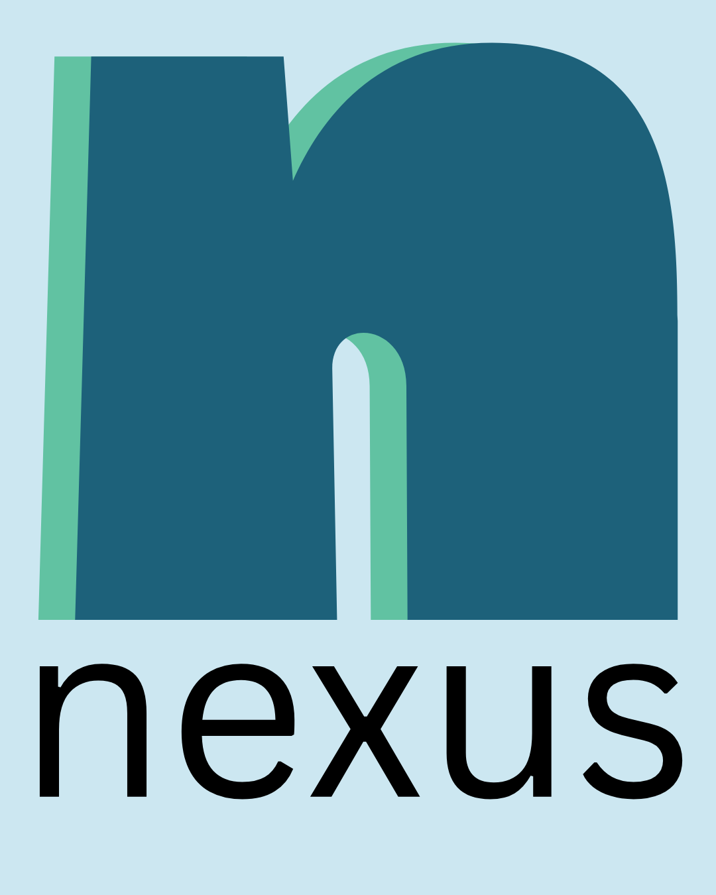

::: {.section1}
**Nexus** \[*noun*\]

1. a connection or series of connections linking two or more things.
2. a connected group or series.
3. the central and most important point or place.
::: 

::: {.spacer-big}

  

  <a href="about.qmd" class="custom-button">About Nexus</a>
  

  

  <a href="#values" class="custom-button">Our Values</a>
  

  

  <a href="the-team.qmd" class="custom-button">Our Team</a>
  

:::

::: {.spacer .section2}
# message from our president

{style="float: left; margin-right: 1.5rem; margin-bottom: 0.5rem;" width=300}

"If you ever felt like student goverment just isn't for you, you are not alone. My name is Kyanne Casperson. I'm a student at the College of Arts and Sciences here at the University of Nebraska-Lincoln. For a lot of students, ASUN feels complicated, hard to access, more about titles and resumes than about creating real change.

I have spent my entire academic career striving to support my fellow students and make a difference on this campus, but it still feels like there's more that I could be doing. It's got me asking, *what's next for us?*

That's why we're creating NEXUS, a place where students can come together to share their ideas, to be heard, and to take action. You don't need to have experience, you don't need to have the right major, you don't have to have it all figured out to make a difference.

I'm running for student body president and student regent here at the University of Nebraska-Lincoln. My goal is to bring people together and see what we can build together. If you're curious, if you care, or if you just want to help, join NEXUS."

- *Kyanne Casperson*
::: 

::: {.section3-2}
# our values {#values}
1. **Student Regent Vote**: Following through on a neglected promise to advocate that the Student Regent position be made a voting member of the UNL Board of Regents.
2. **Addressing Financial Insecurity**: Ensuring the basic needs of the students at this university are met, from books & supplies to housing & food. All Huskers deserve an equal chance to succeed.
3. **Bringing Students Together**: Creating mentorship and community-building opportunities between undergrad, international, graduate, and professional school students.
4. **Increase Involvement with the Nebraska Legislature**: Increasing student understanding of the Nebraska Legislature's role in recent UNL budget issues and increasing student involvement where possible.
:::

::: {.section2 .spacer}
# get involved
We are looking for motivated students to join our campaign. While the A2 form deadline has passed, you can still get involved! Visit [our team page](the-team.qmd) and contact our executive team.
:::

::: {.section3 .spacer}
# support us
Do you like what you see? You can directly aid our efforts in the current ASUN election by donating. Please reach out to Liam Linder at [llinder4@huskers.unl.edu](mailto:llinder4@huskers.unl.edu) or Kyanne Casperson at [kcasperson2@huskers.unl.edu](mailto:kcasperson2@huskers.unl.edu).
:::