::: {.section1 .spacer style="overflow: hidden;"}
# Kyanne Casperson
*President*

Sociology - Senior

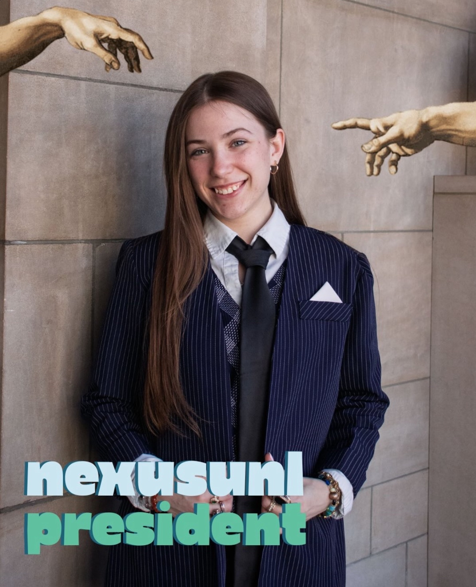{style="float: left; margin-right: 1.5rem; margin-bottom: 0.5rem;" width=300}
*"Sometimes if you want something you have to go and get it for yourself.*

*As a student at the University of Nebraska-Lincoln, I want to be represented by a student government and student leadership that acts on behalf of the interests of the entire student body, not just their own. I want to be represented by a student government and student leadership that follows through on promises and answers to the expressed will of the students.*

*That's why I’m running for President of the Student Body and Student Regent in the upcoming ASUN elections; because I believe that my fellow students deserve a candidate who leads with conviction, courage, and care.*

*Vote for the candidate most determined to lead a student government that is more accessible, welcoming, and representative of all students at the University of Nebraska-Lincoln. Vote for Kyanne Casperson for President of the Student Body on MyRed on March 31st and April 1st."*
:::

::: {.section2 .spacer style="overflow: hidden;"}
# Bret Fulton
*Internal Vice President*

Political Science - Junior

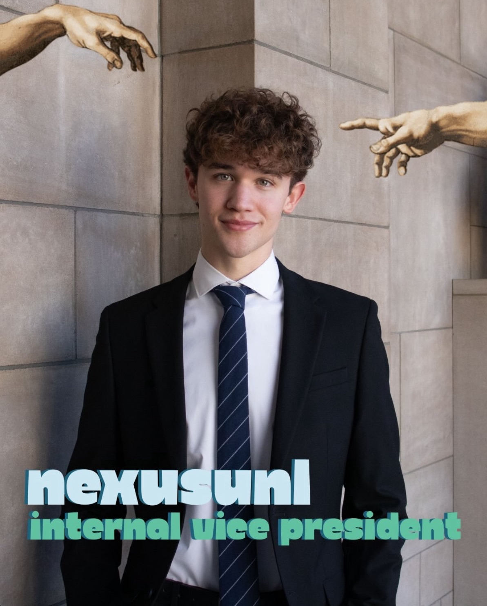{style="float: left; margin-right: 1.5rem; margin-bottom: 0.5rem;" width=300}

*"Since the start of my undergraduate education at UNL, I have had the privilege of working with student leaders across our campus. It’s the peer mentors who help students find their place on campus. It’s the visionary leaders who create and build RSOs. It’s the student advocates attempting to save academic programs from budget cuts.*

*I am running to strengthen the voices of my fellow students, by advocating for a voting student regent at the legislature and seeking students’ input to inform our decisions and policy agendas. We are running to implement a policy framework to bring genuine transparency from student government and deliver programs that lower financial barriers to attaining an education.*

*Throughout my time at UNL, I have led student voter engagement initiatives and have had the privilege of connecting fellow first generation students with peer support and tutoring services at the CAST office. I’ve begun creating an RSO that's brought together a group of students dedicated to peer support for individuals facing financial, housing, and/or food insecurity.*

*Our team is rooted in the power of grassroots student leadership. We are a student election group dedicated to public service and strengthening the role of students at our institution.*

*Vote for the student election group that champions student voices.*

*Vote \@nexusunl in MyRed March 31-April 1."*
:::

::: {.section3 .spacer style="overflow: hidden;"}
# Rayne Aurit
*External Vice President*

Statistics and Data Analytics, Computer Science - Junior

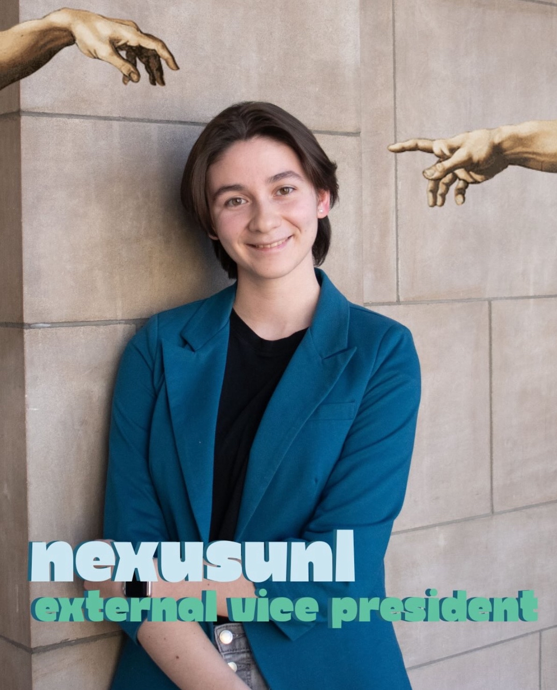{style="float: left; margin-right: 1.5rem; margin-bottom: 0.5rem;" width=300}

*"I believe that UNL should be a place where all types of people can come and thrive at. Students should be able to invest into an education without risk of their program being eliminated. We need a student government that acts in the interest of all students. Every person and every interaction matters, and our decisions should reflect that.*

*As a student impacted by the budget cuts of this past semester, I believe that there should be more ways that ASUN should act as a liaison and representative of the student body. Students should be aware of the ongoing bills that affect their lives at UNL."*
:::

::: {.section1 .spacer style="overflow: hidden;"}
# Nathan Eisenmenger
*CAS Senator*

Psychology - Senior

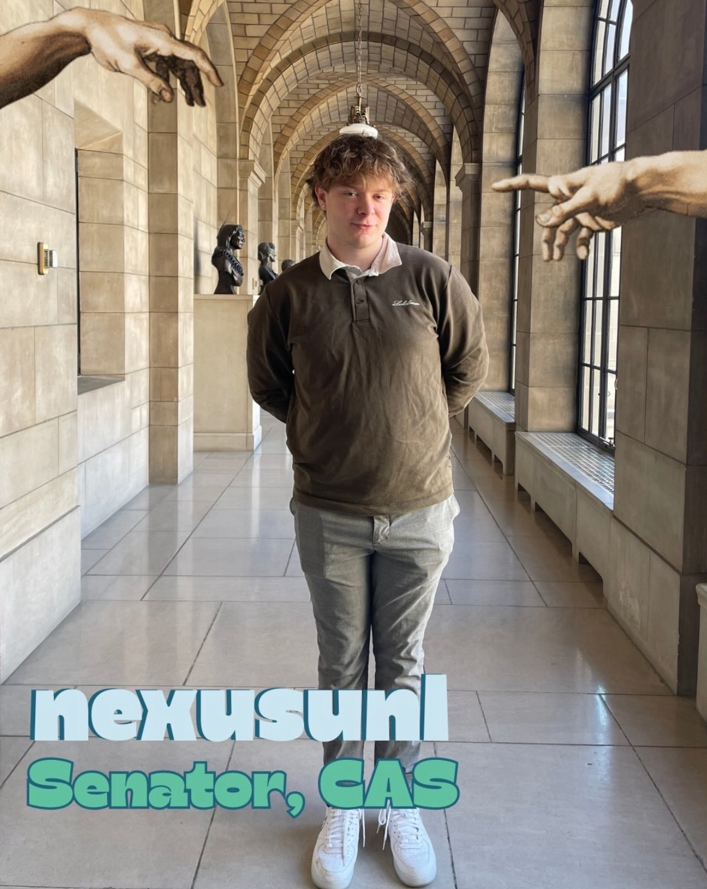{style="float: left; margin-right: 1.5rem; margin-bottom: 0.5rem;" width=300}

*"My name is Nathan Eisenmenger and I am excited to announce I am running for senator. I am from Columbus, NE, and I am a Psychology major with minors in Spanish and Music Technology.*

*I am running because I have a firm belief that the student government that is elected by the student body should act in the best interests of its constituents. Unfortunately, many feel that hasn’t been the case. The student body deserves a government that is open, honest, transparent, and accessible to them. My hope is that I, along with the NEXUS team, can foster a positive impact on campus and bring change so the voices of the students are heard.  Above all, I hope that the student body can trust me with their vote to do the right thing and vote for policies that will improve their time here at UNL and positively impact campus."*
:::

::: {.section2 .spacer style="overflow: hidden;"}
# Chris Olson
*CASNR Senator*

Grassland Systems: Ecology and Management, Data Science - Sophomore

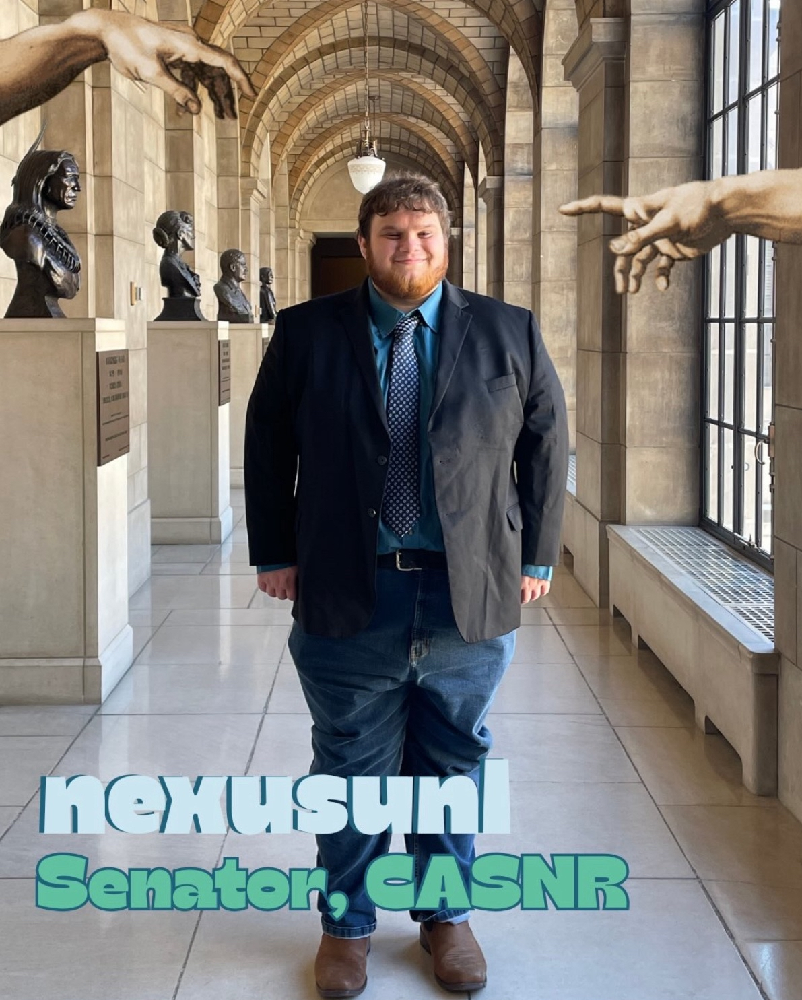{style="float: left; margin-right: 1.5rem; margin-bottom: 0.5rem;" width=300}

*"Transfer and Non-Traditional students face challenges that other students don't face. I want to help bring their challenges to the forefront, and work within ASUN to help Transfer and non traditional students thrive. Additionally one of my majors was cut as a part of the recent cut. I want to help people like me and advocate for the students affected by these cuts."*
:::

::: {.section3 .spacer style="overflow: hidden;"}
# Praneetha Thutika
*CAS Senator*

Cellular Biochemistry - Junior

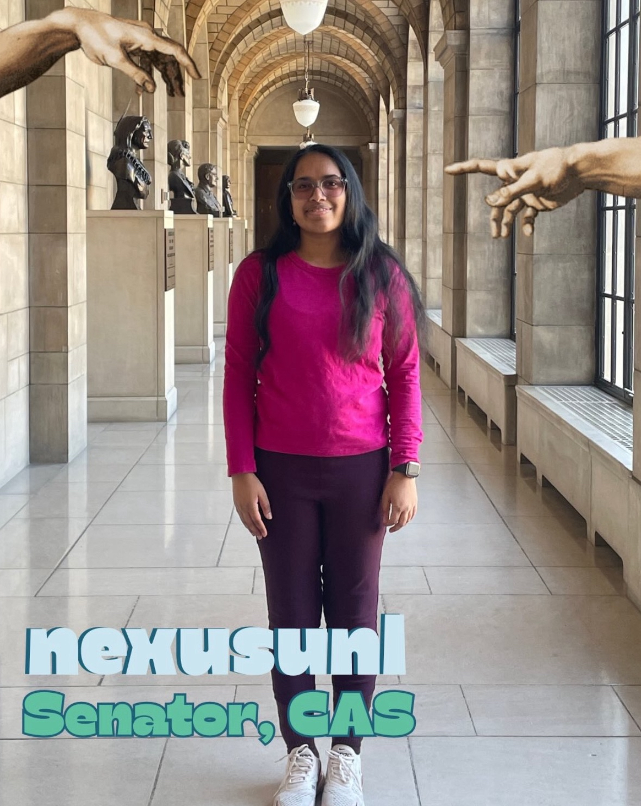{style="float: left; margin-right: 1.5rem; margin-bottom: 0.5rem;" width=300}

*"I am running for CAS Senator because our students deserve strong representation, clear communication, and leaders who follow through. I'm ready to listen, lead, and work to make CAS a community where every student can succeed."*
:::

::: {.section1 .spacer style="overflow: hidden;"}
# Johanna Dorhout
*Law Senator*

Law - graduate class of 2028

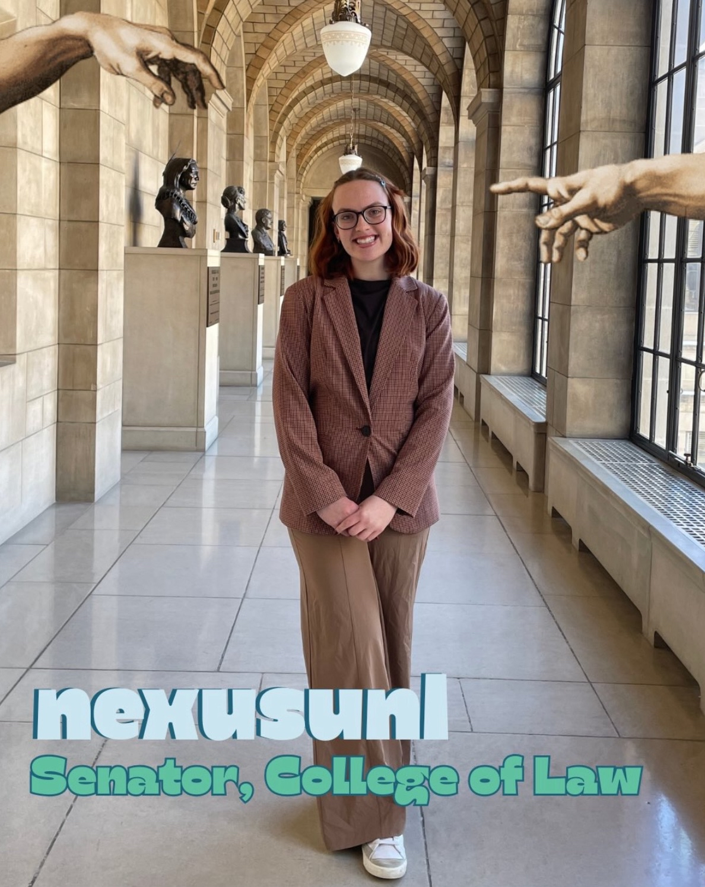{style="float: left; margin-right: 1.5rem; margin-bottom: 0.5rem;" width=300}

*"I want to better integrate the graduate and undergraduate students and improve student engagement. Students need to care about student government to participate and keep ASUN democratic!"*
:::

::: {.section2 .spacer style="overflow: hidden;"}
# Dalton Kelberlau
*CAS Senator*

Biochemistry - Freshman

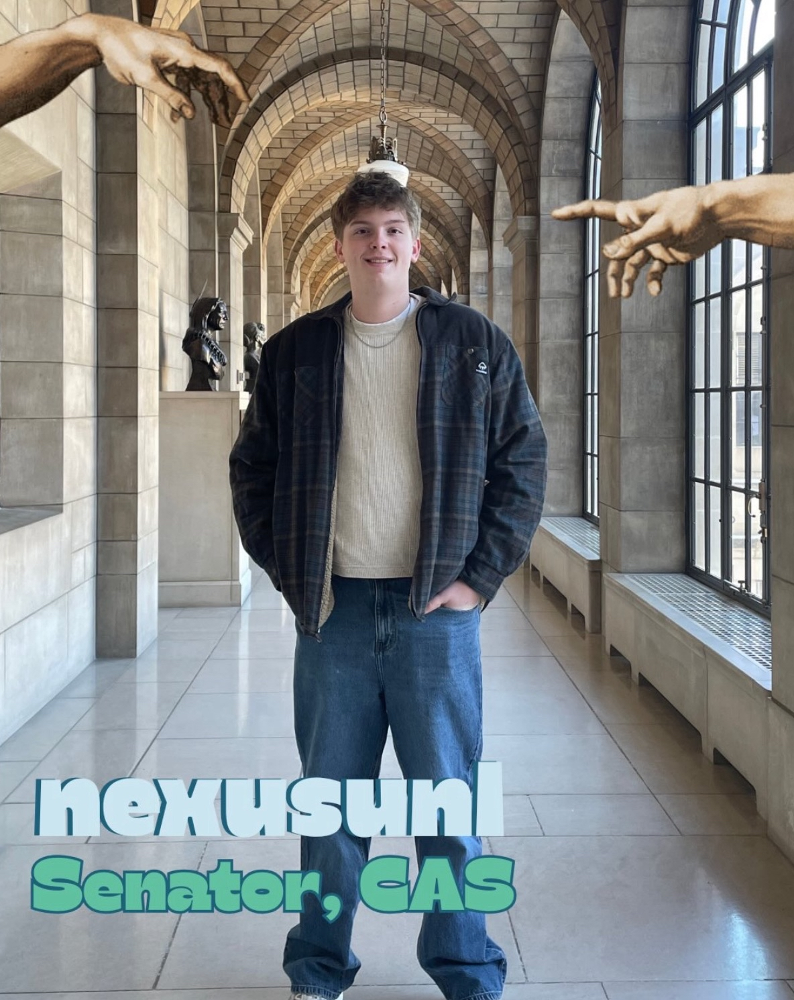{style="float: left; margin-right: 1.5rem; margin-bottom: 0.5rem;" width=300}

*"As a candidate for Senator for the College of Arts and Sciences, I want to work to make our school more accessible and safe for all students while creating greater transparency within student government. Students deserve to know how decisions are being made and to feel confidence that their concerns are being heard. I hope to serve as a voice that listens, communicates openly, and advocates for the needs of the students."*

:::

::: {.section3 .spacer style="overflow: hidden;"}
# Mariah Lieberman
*COB Senator*

Actuarial - Sophomore

{style="float: left; margin-right: 1.5rem; margin-bottom: 0.5rem;" width=300}

*"I am running for College of Business Senator because I am a strong leader ready to bring new ideas to the board. Even more importantly, I am ready to listen to the issues my fellow students are facing and find solutions.*

*I have been an officer of three RSO's holding a different position in each to allow for a diverse perspective in leadership, along with meeting people from all kinds of majors in order to hear throughout campus what other colleges are doing that are working well for them and what isn't.*

*The College of Business needs someone who wants to represent all the majors we have to offer and I am just that person."*
:::

::: {.section1 .spacer style="overflow: hidden;"}
# Ariel Larios
*Grant Selections Committee*

Biology, Premed - Freshman

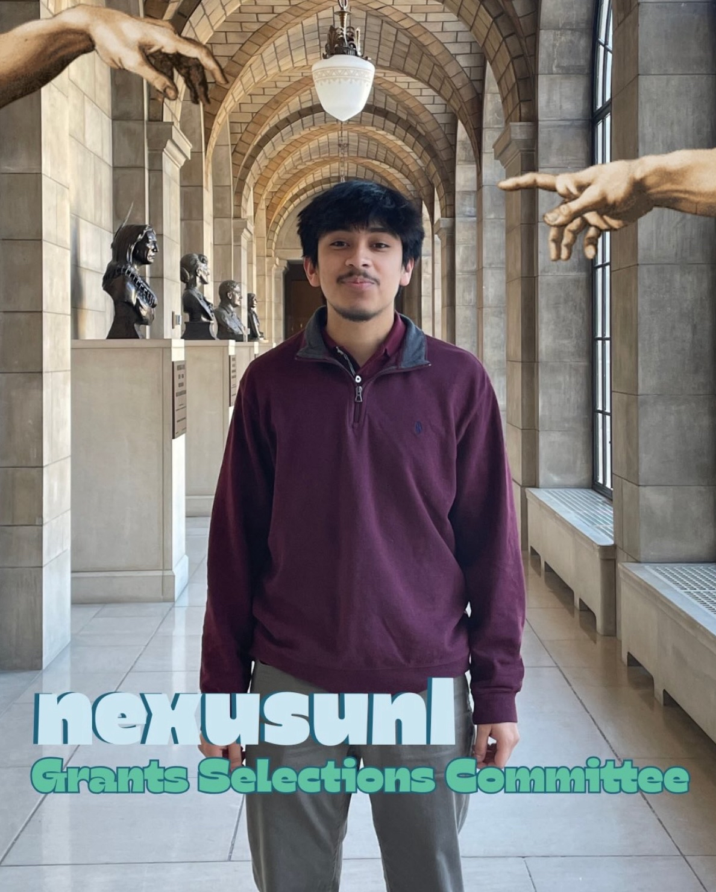{style="float: left; margin-right: 1.5rem; margin-bottom: 0.5rem;" width=300}

*"My name is Ariel Larios and I am running for Grants Selections Committee! This is my first year at UNL and I am majoring in Biology on a premed track. I am running to be more involved at UNL, learn new skills, and meet new people."*
:::

::: {.section2 .spacer style="overflow: hidden;"}
# Griffin Ryan
*Grant Selection Committee*

Law - graduate class of 2028

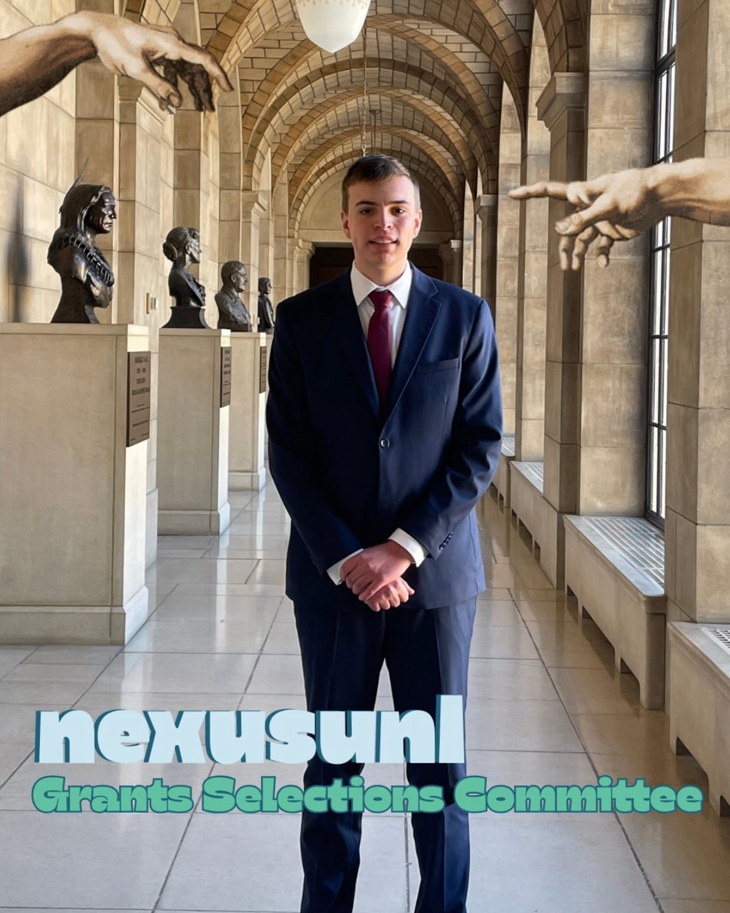{style="float: left; margin-right: 1.5rem; margin-bottom: 0.5rem;" width=300}

*"There should be more collaboration between undergraduate and graduate students. ASUN represents all students on campus but has suffered from leaving graduate students out of the democratic process. By encouraging more cooperation and collaboration, ASUN can become a legislative body that more effectively takes into account the needs of undergraduate and graduate alike through mentorship programs and academic partnerships."*
:::

::: {.section3 .spacer style="overflow: hidden;"}
# MJ Jabbar
*Fee Allocation Committee*

International/Global Studies - Senior

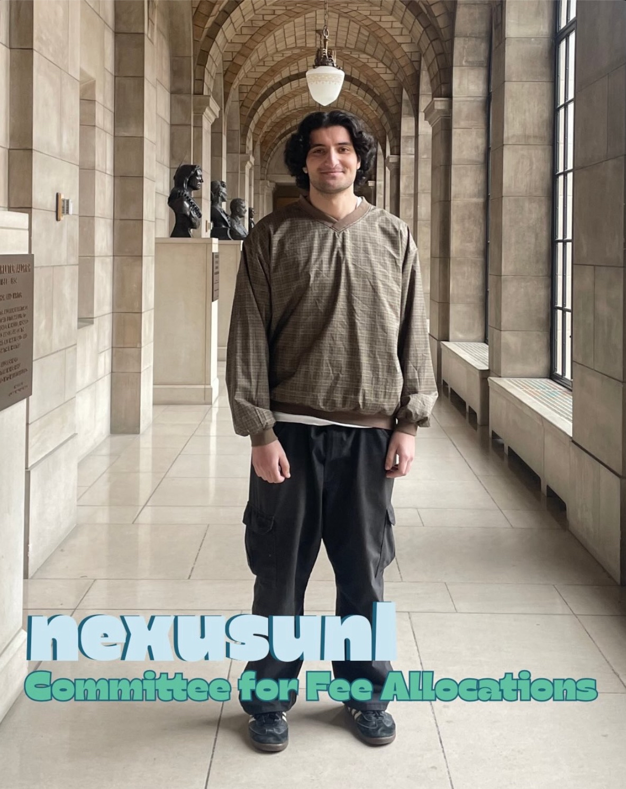{style="float: left; margin-right: 1.5rem; margin-bottom: 0.5rem;" width=300}

*"Hey, I'm MJ. I'm running for student government to serve on the Fee Allocation Committee. I want to help make sure student fees are used fairly and transparently, and they they support the organizations that matter to students."*
:::

::: {.section1 .spacer style="overflow: hidden;"}
# Liam Linder
*Treasurer*

Family and Consumer Sciences Education - Sophomore

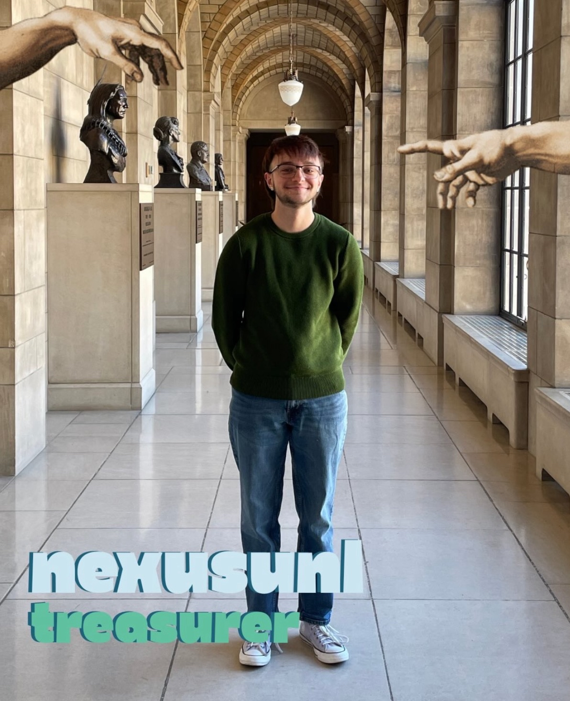{style="float: left; margin-right: 1.5rem; margin-bottom: 0.5rem;" width=300}

*"The student government should advocate for the students at the university first and foremost. A student government who listens to the students and follows through on those promises is key for every student to succeed in college."*
:::

::: {.section2 .spacer style="overflow: hidden;"}
# B Littman
*Assisting with Nexus*

Mechanical Engineering - Senior

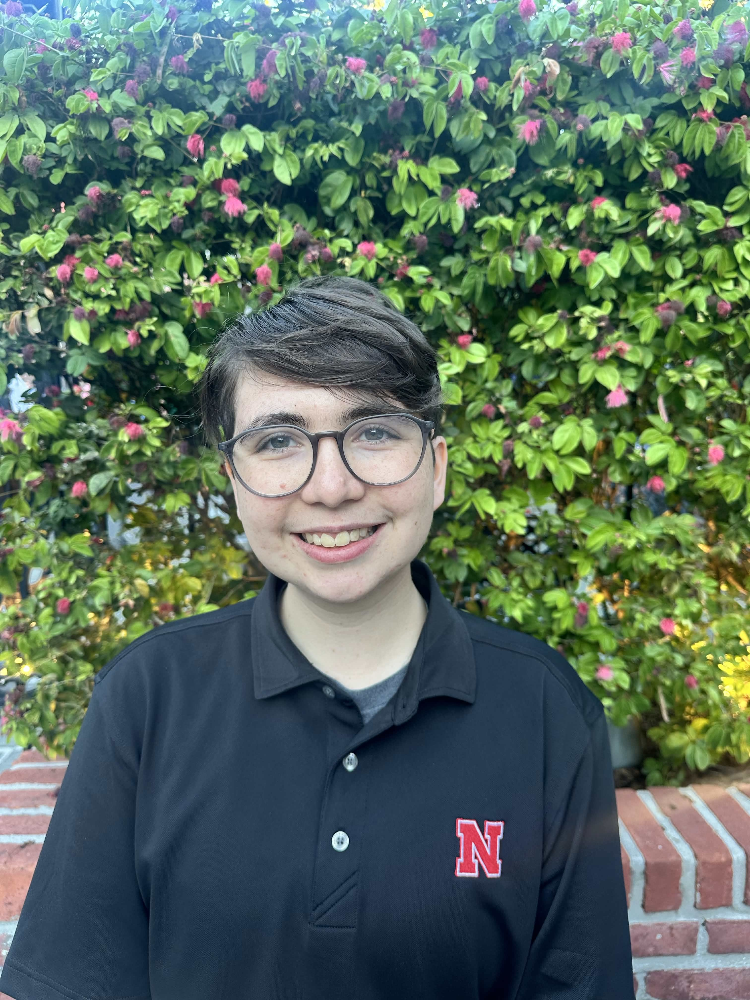{style="float: left; margin-right: 1.5rem; margin-bottom: 0.5rem;" width=300}

*"As an involved student, I have seen firsthand the positive impact that student leaders can have on campus. Over my 5 years on campus I have interacted with a lot of campus offices and resources and I want to support the next generation of ASUN leaders by sharing everything I've learned. I want to see student leadership that represents all students, valuing transparency and collaboration.*

*Vote @nexusunl in MyRed March 31-April 1."*
:::

::: {.section3-2 .spacer}
Want to see your name up here? You can still join Nexus without running for a position. Visit our NvolveU or reach out to an executive member. 

Kyanne: [kcasperson2@huskers.unl.edu](mailto:kcasperson2@huskers.unl.edu)

Bret: [bfulton10@huskers.unl.edu](mailto:bfulton10@huskers.unl.edu)

Rayne: [raurit2@huskers.unl.edu](mailto:raurit2@huskers.unl.edu)
:::
